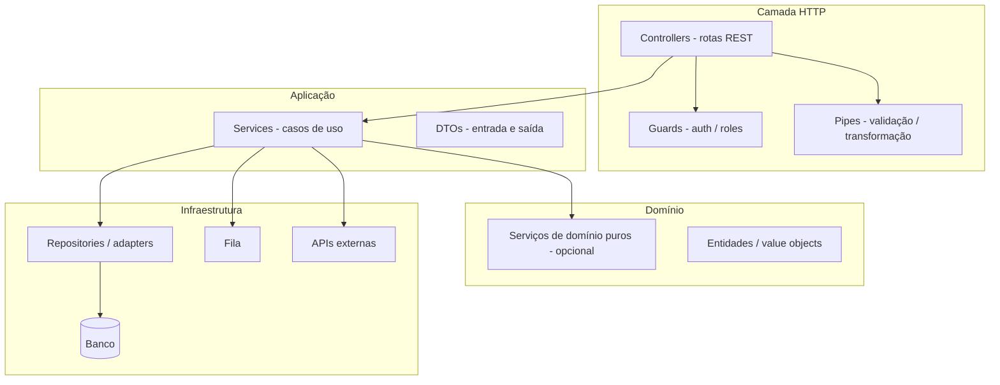
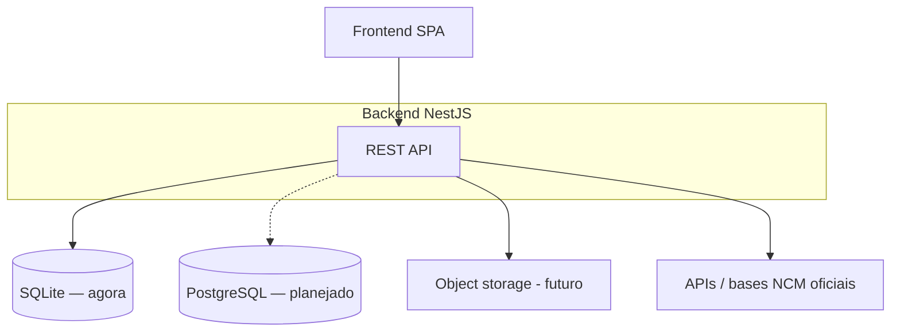

# Arquitetura — Backend

Documento de referência da API HTTP do monorepo **seven-reforma-tributaria**. Complementa o **`AGENTS.md`** na raiz com camadas NestJS, limites de domínio e evolução prevista.

---

## 1. Contexto e objetivos

| Aspecto | Descrição |
|---------|-----------|
| **Produto** | API para reforma tributária: **NCM**, **planilhas** (importação/processamento), **análises** e relatórios. |
| **Papel do backend** | Única fonte de verdade para **regras de negócio**, validação de dados fiscais, persistência e integrações (bases oficiais, storage, filas). |
| **Stack** | **NestJS 11** + **TypeScript** (Express por padrão via `@nestjs/platform-express`). |

---

## 2. Stack técnica

| Camada | Tecnologia | Uso |
|--------|------------|-----|
| Framework | NestJS 11 | Módulos, injeção de dependência, pipes, guards, interceptors |
| Linguagem | TypeScript | Strict; comentários em português quando explicarem domínio BR |
| HTTP | Express (via Nest) | REST; evolução para OpenAPI/Swagger recomendada |
| Persistência | **TypeORM** + **SQLite** (`better-sqlite3`) | Desenvolvimento e MVP: arquivo único; `autoLoadEntities`, `synchronize` apenas fora de `production` |
| Testes | Jest + Supertest | Unitário e e2e (`test/app.e2e-spec.ts`) |

**Evolução planejada:** migrar para **PostgreSQL** (mesmo TypeORM: trocar `type` e credenciais, desativar `synchronize`, adotar **migrations**). Filas (BullMQ) e **object storage** para planilhas entram quando o fluxo exigir.

---

## 3. Princípios

1. **Backend decide:** classificação, consistência com bases oficiais, cálculos e agregações usados pelo produto.
2. **API explícita:** DTOs com validação (`class-validator` + `ValidationPipe` global) e respostas previsíveis.
3. **Modularidade:** um módulo Nest por área de domínio coesa (ex.: `NcmModule`, `SpreadsheetModule`, `AnalyticsModule`).
4. **Infraestrutura em inglês:** nomes de guards, pipes, módulos de infra; **domínio** pode seguir vocabulário do negócio em português em DTOs e mensagens ao usuário, alinhado ao `AGENTS.md`.

---

## 4. Visão em camadas (NestJS)



- **Controllers:** finos — recebem DTO, chamam service, retornam DTO/view model.
- **Services:** orquestram regras, transações e chamadas a repositórios.
- **Domínio:** extrair serviços puros quando a lógica fiscal ficar grande demais para um único service anêmico.

---

## 5. Estrutura de pastas (atual e alvo)

**Estado atual:**

```
backend/
├── data/                      # Diretório do .sqlite (arquivo ignorado no git; .gitkeep mantém a pasta)
├── src/
│   ├── main.ts                # Bootstrap, CORS, ensureDatabaseDirectory
│   ├── app.module.ts          # TypeOrmModule.forRoot (SQLite)
│   ├── config/
│   │   └── database.config.ts # Caminho SQLite, opções TypeORM
│   ├── app.controller.ts
│   └── app.service.ts
└── .env.example
```

**Estrutura alvo recomendada:**

```
backend/src/
├── main.ts
├── app.module.ts              # Importa módulos de feature
├── common/                    # Cross-cutting
│   ├── filters/               # Filtros de exceção HTTP
│   ├── guards/                # JwtAuthGuard, etc.
│   ├── interceptors/          # Logging, transformação de resposta
│   └── pipes/                 # Pipes reutilizáveis se necessário
├── config/                    # ConfigModule, validação de env (Joi/Zod)
├── ncm/                       # Feature: consulta e regras NCM
│   ├── ncm.module.ts
│   ├── ncm.controller.ts
│   ├── ncm.service.ts
│   └── dto/
├── spreadsheets/              # Feature: upload, jobs, status
│   └── ...
├── analytics/                 # Feature: agregações e relatórios
│   └── ...
└── health/                    # Health check para load balancer
```

Cada feature segue o padrão **module + controller + service**; subpastas `dto/`, `entities/` ou `repositories/` conforme a complexidade.

---

## 6. Domínio: módulos de negócio

| Módulo (conceitual) | Responsabilidade | Observações |
|---------------------|------------------|-------------|
| **NCM** | Busca por código/descrição, detalhe, validação de formato, integração com tabela oficial | Fontes e periodicidade de atualização documentadas em ADR ou doc de dados |
| **Spreadsheets** | Upload, parsing, validação de colunas, fila de processamento, status do job | Arquivos grandes: streaming ou processamento assíncrono |
| **Analytics** | Endpoints de agregação consumidos pelo dashboard (totais, séries) | Queries otimizadas; mesma regra de cálculo usada em exportações |

---

## 7. API HTTP

- **Prefixo global (recomendado):** `api/v1` via `app.setGlobalPrefix('api/v1')` para versionar sem quebrar clientes.
- **Validação:** `ValidationPipe` com `whitelist` e `forbidNonWhitelisted` para DTOs.
- **Erros:** filtro global mapeando exceções de domínio para códigos HTTP e corpo `{ message, code }` estável para o frontend.
- **Documentação:** `@nestjs/swagger` quando os DTOs estiverem estáveis.

---

## 8. Segurança

- **CORS:** `FRONTEND_ORIGIN` (default `http://localhost:8080` em `main.ts`); em produção, origem explícita.
- **Secrets:** nunca no código; apenas variáveis de ambiente (`UPPER_SNAKE_CASE`).
- **Auth (futuro):** JWT ou sessão; guards em rotas privadas; rate limiting (`@nestjs/throttler`) em login e endpoints sensíveis.

---

## 9. Dados e consistência

### Persistência hoje (SQLite)

- **Arquivo:** configurável via `DATABASE_PATH` (padrão `data/app.sqlite` relativo ao cwd do processo em `backend/`).
- **Driver:** `better-sqlite3` via TypeORM.
- **Schema:** `synchronize: true` quando `NODE_ENV !== 'production'` — conveniente em dev; **não** confiar nisso em produção (usar migrations).
- **Git:** o arquivo `.sqlite` não é versionado; a pasta `data/` permanece no repositório com `.gitkeep`.

### Futuro (PostgreSQL)

- Mesmas **entidades** TypeORM; ajustar `TypeOrmModule.forRoot` (ou `forRootAsync` com `ConfigModule`) para `type: 'postgres'`.
- Introduzir **migrations** (`typeorm migration:*`) antes de cortar para produção.
- Tipos SQL: preferir `timestamptz` / `date` alinhados à política de timezone do produto.

### Regras gerais

- **Transações:** operações que alteram múltiplas tabelas no mesmo request devem usar transação explícita no service/repository.
- **Datas:** alinhar com `AGENTS.md` se o monorepo adotar UTC em API; documentar timezone para relatórios fiscais.
- **Planilhas:** validar tipos antes de persistir; logs de rejeição sem dados pessoais em claro em produção.

---

## 10. Observabilidade

- **Logging:** `Logger` do Nest com contexto (request id quando houver middleware).
- **Health:** endpoint `GET /health` ou `/api/v1/health` para Kubernetes/load balancer.

---

## 11. Testes

| Tipo | Escopo | Ferramenta |
|------|--------|------------|
| Unitário | Services, puro domínio | Jest |
| Integração | Controller + service com DB de teste | Jest + módulo de teste Nest |
| E2E | Fluxo HTTP completo | Supertest (`test/app.e2e-spec.ts`) |

---

## 12. Diagrama de contexto (C4 simplificado)



---

## 13. Decisão: NestJS vs Go

- **NestJS** permanece o serviço principal deste repositório para produtividade, tipagem compartilhada com o front e módulos claros.
- **Go** só se justificar como **serviço separado** (worker, ingestão massiva) com contrato HTTP/gRPC; não duplicar regras fiscais em dois linguagens sem necessidade.

---

## 14. Referências cruzadas

- Convenções do monorepo: **`AGENTS.md`** (raiz).
- UI e fluxos do usuário: **`frontend/docs/architecture/architecture.md`**.
