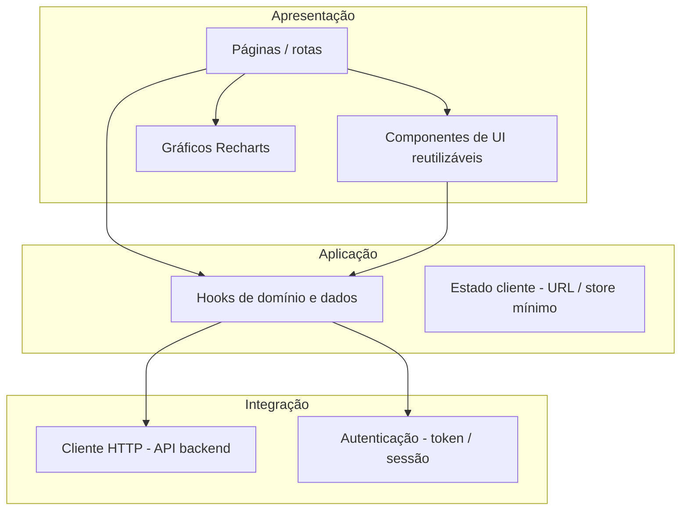
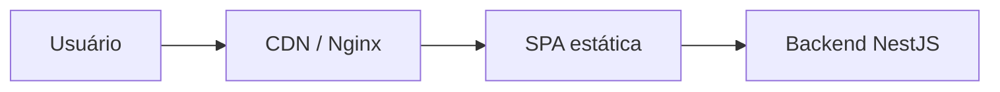

# Arquitetura — Frontend

Documento de referência da camada web (SPA) do monorepo **seven-reforma-tributaria**. Complementa o **`AGENTS.md`** na raiz com visão de componentes, fluxos e convenções de pastas.

---

## 1. Contexto e objetivos

| Aspecto | Descrição |
|---------|-----------|
| **Produto** | Sistema web para reforma tributária: consultas **NCM**, importação e tratamento de **planilhas**, **análises** e visualizações. |
| **Papel do frontend** | Interface única para o usuário: busca, formulários, tabelas, gráficos e feedback; **sem** duplicar regras fiscais críticas — a fonte da verdade das regras fica no **backend**. |
| **Deploy** | Artefato estático (`dist/`) servido por CDN ou reverse proxy; comunicação com API via HTTPS. |

---

## 2. Stack técnica

| Camada | Tecnologia | Observação |
|--------|------------|------------|
| Runtime UI | **React 19** | Componentes funcionais, hooks. |
| Build / dev | **Vite 8** | HMR, build otimizado para produção. |
| Linguagem | **TypeScript** | Strict; nomes de símbolos em inglês. |
| Estilo | **Tailwind CSS v4** + `@tailwindcss/vite` | Utility-first; tema claro/escuro via classes `dark:`. |
| Ícones | **lucide-react** | Ícones SVG consistentes. |
| Gráficos | **Recharts** | Séries temporais, barras, linhas para dashboards analíticos. |
| UI composta | **Radix UI Slot** + **CVA** + **clsx** + **tailwind-merge** | Variantes de componente (`Card`, etc.) e merge de classes sem conflito. |

**Alias de importação:** `@/` → `src/` (configurado em `vite.config.ts` e `tsconfig.app.json`).

### 2.1 Cores e tokens de design (`src/constants/`)

| Arquivo | Papel |
|---------|--------|
| **`constants/Colors.ts`** | **Única fonte** de valores de cor (hex) da aplicação. Não definir `#rrggbb` ou `rgb()` em componentes, CSS solto, props de bibliotecas (Recharts, etc.) — importar `Colors` ou usar utilitários Tailwind ligados ao tema (ver abaixo). |
| **`constants/Tokens.ts`** | **Tipografia**: famílias de fonte, tamanhos (`rem` e `px` para libs que exigem número), pesos, interlinha e tracking. Base para classes `text-*` mapeadas no `@theme` e para estilos inline quando necessário. |
| **`theme/applyTheme.ts`** | Sincroniza `Colors` e `Tokens` com **variáveis CSS** `--app-*` no `document.documentElement`. Chamado no início de `main.tsx` **antes** da renderização. |
| **`index.css`** (`@theme`) | Declara utilitários Tailwind (`bg-background`, `text-foreground`, `text-lg`, etc.) **apenas** como `var(--app-…)` — **sem hex** no arquivo. |

**Identidade Seven (marca):** empresa **Seven Sistemas de Automação**; logo em `src/assets/logo.png` (uso na UI) e cópia em `public/favicon.png` para aba do navegador. Título do documento: **`Seven | Reforma Tributária`**. Paleta em `Colors.ts`: branco `#FFFFFF`, fundo alternativo `#EBF1FA`, primária `#002E48`, secundária `#00677E`, texto `#444444`. Tipografia web: **Inter** e **Public Sans** carregadas via Google Fonts em `index.html`, com fallbacks em `Tokens.ts`.

**Regras práticas:**

- Preferir classes semânticas: `bg-background`, `bg-background-muted`, `text-foreground`, `text-primary`, `text-secondary`, `border-border`, `text-muted-foreground`, `bg-card`, etc.
- Gráficos (Recharts) e estilos que não aceitam classe: `fill={Colors.chartPrimary}`, `stroke={Colors.border}`, `fontSize: Tokens.fontSize.sm`.
- Novas cores: adicionar em **`Colors.ts`**, mapear em **`applyTheme.ts`** e, se precisar de utilitário Tailwind, registrar em **`@theme`** em `index.css`.
- Tipografia nova: adicionar em **`Tokens.ts`** e propagar em **`applyTheme.ts`** + `@theme` quando houver classe correspondente.

---

## 3. Visão em camadas



- **Apresentação:** páginas, layout, componentes presentacionais e gráficos.
- **Aplicação:** hooks que orquestram chamadas, cache local (React Query é candidato futuro) e estado que não pertence ao servidor.
- **Integração:** cliente HTTP tipado, base URL via env, interceptors para auth e erros.

---

## 4. Estrutura de pastas (atual e alvo)

**Estado atual** (bootstrap):

```
frontend/src/
├── main.tsx              # Entrada React — chama applyTheme() antes do root
├── index.css             # Tailwind @theme (só var(--app-*), sem hex)
├── theme/
│   └── applyTheme.ts     # Colors + Tokens → variáveis CSS
├── constants/
│   ├── Colors.ts         # Fonte única de hex / cores
│   └── Tokens.ts       # Tipografia e escalas
├── App.tsx               # Shell inicial (substituir por router quando houver rotas)
├── assets/               # SVGs e imagens estáticas
├── components/
│   └── ui/               # Primitivos de UI (Card, Button, …)
└── lib/
    └── utils.ts          # helpers (ex.: cn)
```

**Estrutura alvo recomendada** à medida que o produto crescer:

```
frontend/src/
├── app/                  # Providers globais, opcional: error boundary
├── routes/               # Definição de rotas (React Router ou similar)
├── pages/                # Uma pasta por rota / feature de página
├── features/             # Opcional: agrupar por domínio (ncm, spreadsheets, analytics)
├── constants/            # Colors.ts, Tokens.ts (mantidos como fonte única)
├── theme/                # applyTheme e evolução do tema
├── components/
│   ├── ui/               # Design system leve (shadcn-like)
│   └── shared/           # Blocos reutilizáveis entre features
├── hooks/                # useNcmSearch, useSpreadsheetUpload, …
├── api/                  # Cliente HTTP, tipos de request/response alinhados ao backend
├── lib/                  # utils, formatadores (datas, NCM mask)
└── types/                # Tipos só de front quando não vierem de pacote compartilhado
```

**Regra:** código que fala com a API fica em **`api/`** ou **`hooks/`** que delegam para `api/` — evitar `fetch` espalhado em componentes de página sem abstração.

---

## 5. Domínio na interface (NCM, planilhas, análises)

| Área de produto | Responsabilidade do frontend | O que não fazer aqui |
|-----------------|------------------------------|----------------------|
| **NCM** | Formatação de exibição (máscara visual), busca, listagem, detalhe | Validar substituto tributário ou regra legal sem espelhar o backend |
| **Planilhas** | Upload (multipart), barra de progresso, preview de colunas, envio do job | Persistência, parsing pesado, regras de negócio de classificação |
| **Análises** | Filtros de UI, agregações **já calculadas** pela API, gráficos e tabelas | Recalcular impostos ou totais que a API já definiu como contrato |

---

## 6. Comunicação com o backend

- **Base URL:** `import.meta.env.VITE_API_URL` (definir em `.env` / `.env.production`).
- **CORS:** o backend habilita origem do Vite em dev; em produção, usar `FRONTEND_ORIGIN` alinhado ao host real.
- **Formato:** JSON; erros HTTP padronizados (corpo com `message` / `code` quando o backend expuser contrato).
- **Autenticação (futuro):** header `Authorization: Bearer <token>`; refresh conforme política definida na API.

---

## 7. Roteamento e estado

- **Rotas:** quando introduzir **React Router** (ou framework file-based), manter páginas finas: compor de componentes e hooks.
- **Estado global:** usar só o necessário (Context ou store leve); preferir **URL como fonte da verdade** para filtros compartilháveis e deep links.
- **Cache de dados:** **TanStack Query** (React Query) é o candidato natural para listagens, invalidação após mutações e estados de loading/erro.

---

## 8. Acessibilidade e UX

- Componentes interativos: foco visível, `aria-*` onde aplicável (Radix facilita padrões).
- Gráficos: fornecer título ou texto alternativo quando o gráfico for o único meio de leitura de um KPI crítico.
- Contraste: ajustar valores em **`Colors.ts`** e validar WCAG; não espalhar hex fora desse arquivo.

---

## 9. Build e ambientes

| Comando | Resultado |
|---------|-----------|
| `npm run dev` | Servidor Vite, em geral `http://localhost:8080` |
| `npm run build` | Saída em `frontend/dist/` |
| `npm run preview` | Servir `dist` localmente para validar produção |

Variáveis públicas expostas ao bundle devem usar prefixo **`VITE_`**.

---

## 10. Testes (direção)

- **Unitários:** Vitest + Testing Library para hooks e componentes isolados.
- **E2E:** Playwright (ou Cypress) para fluxos críticos (login, upload, consulta NCM) quando a API estiver estável.

---

## 11. Diagrama de deploy simplificado



---

## 12. Referências cruzadas

- Convenções globais do monorepo: **`AGENTS.md`** (raiz).
- Contratos de API e regras de negócio: **`backend/docs/architecture/architecture.md`**.
